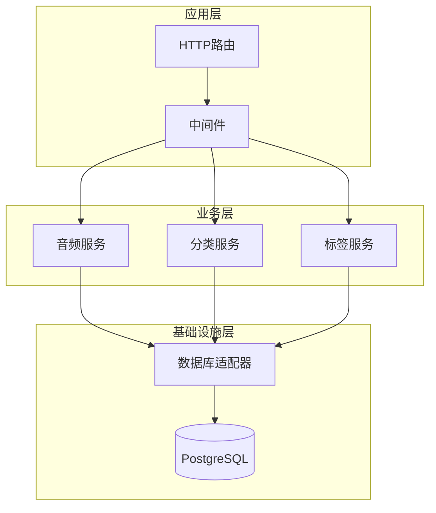
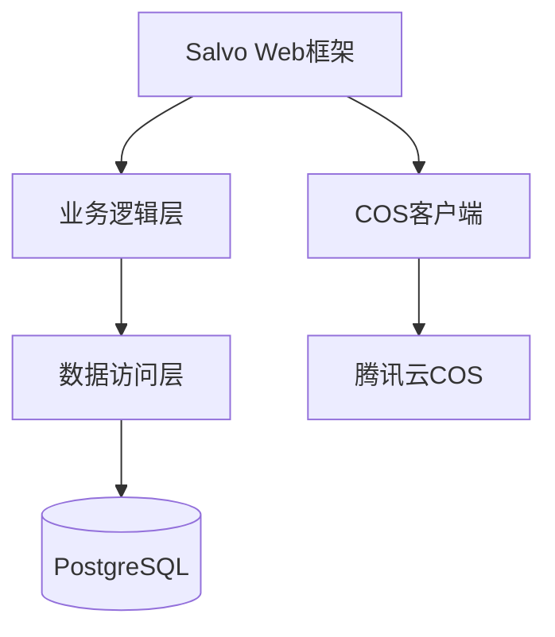

# 睡眠星球后端服务架构说明

## 项目简介
睡眠星球后端服务是基于 Salvo 框架 构建的白噪音 APP 后端系统，集成腾讯云 COS 存储音频资源，提供安全、高效的音频资源管理与 API 服务。系统包含资源管理、多维度检索、DDoS 防护等核心模块，支持容器化部署与集群管理，旨在为前端提供稳定的音频资源获取渠道。

## 技术架构

### 代码结构
```plaintext
src/
├── main.rs       # 入口文件，启动服务
├── router/       # 路由定义
│   ├── audio.rs  # 音频相关路由（含推荐/管理接口）
│   ├── admin.rs  # 管理员相关路由（含用户/审计接口）
│   └── middleware/ # 中间件集合
│       ├── auth.rs    # JWT认证中间件（校验请求权限）
│       └── rate_limit.rs # 限流中间件（防止恶意请求）
├── service/      # 业务逻辑层
│   ├── audio.rs  # 音频服务（元数据操作/推荐算法）
│   ├── category.rs # 分类服务（分类树构建/校验）
│   ├── tag.rs    # 标签服务（标签关联/去重）
│   └── user.rs   # 用户服务（权限校验/审计日志）
├── model/        # 数据模型
│   ├── audio.rs  # 音频元数据结构体（含标题/时长/格式）
│   ├── category.rs # 分类结构体（含父级ID/层级）
│   └── tag.rs    # 标签结构体（含关联音频计数）
├── error/        # 错误处理模块
│   ├── mod.rs    # 自定义错误类型定义（如ServiceError、DbError）
│   └── handler.rs# HTTP错误响应格式化
├── common/       # 公共模块
│   ├── utils.rs  # 通用工具函数（时间格式化/文件指纹生成）
│   └── config.rs # 配置解析（读取.env文件，含COS密钥）
└── adapter/      # 基础设施适配器
    ├── db.rs     # 数据库操作封装（sqlx执行/连接池管理）
    └── cos.rs    # COS存储适配器（文件上传/下载签名）
```

### 框架结构


#### 模块说明


### 核心组件
| 模块 | 技术方案 | 版本要求 |
|------|---------|--------|
| Web框架 | Salvo | 0.45+ |
| 数据库 | PostgreSQL | 13+ |


## 功能模块详述
### 音频资源管理
#### 文件存储流程
1. 前端上传MP3文件（≤50MB）
2. 生成SHA256文件指纹
3. 异步转码为128kbps/256kbps双版本
4. 元数据写入PostgreSQL

### 安全体系
#### 认证流程
```sequence
Frontend->Backend: 提交账号密码
Backend->DB: 验证用户凭证
DB-->Backend: 返回用户权限
Backend-->Frontend: 签发JWT(有效期2h)
```

## 部署指南
### 容器化配置
```dockerfile
FROM rust:1.65 as builder
WORKDIR /app
COPY . .
RUN cargo build --release

FROM debian:bullseye-slim
COPY --from=builder /app/target/release/sleepplanet-backend /usr/local/bin/
CMD ["sleepplanet-backend"]
```

## 开发者指引
### 分支管理策略
| 分支类型 | 命名规范 | 说明 |
|---------|---------|------|
| 主分支 | main | 保护分支，仅接受PR合并 |
| 功能分支 | feature/* | 需关联JIRA任务ID |
| 热修复分支 | hotfix/* | 从tag创建紧急修复 |


# 配置环境变量（示例）
cp .env.example .env
vim .env  # 填入数据库连接、COS 密钥等信息

# 启动服务
cargo run --release
```


## API 文档

### 开放接口规范

#### 管理员接口示例
```http
POST /api/v1/audio
Authorization: Bearer <EDITOR_TOKEN>
Content-Type: application/json

{
  "title": "自然白噪音",
  "duration": 2400,
  "formats": ["128kbps", "256kbps"],
  "category_id": "cat_123"
}
```

#### 音频推荐接口示例
```http
GET /api/v1/recommend/audio?user_id=usr_456&type=sleep
Authorization: Bearer <JWT_TOKEN>

{
  "code": 200,
  "data": [
    {"id": "aud_789", "title": "雨夜助眠"},
    {"id": "aud_012", "title": "溪流白噪音"}
  ]
}
```
```http
GET /api/v1/admin/audit-logs
Authorization: Bearer <ADMIN_TOKEN>

{
  "operation": "音频删除",
  "operator": "admin@domain.com",
  "timestamp": "2023-08-20T08:30:00Z"
}
```
```http
GET /api/v1/audio/{id}
Authorization: Bearer <JWT_TOKEN>

{
  "code": 200,
  "data": {
    "title": "冥想音乐集",
    "duration": 1800,
    "formats": ["128kbps", "256kbps"]
  }
}
```

#### 接口矩阵
| 模块       | 端点                      | 方法  | 权限     | 说明                     |
|------------|---------------------------|-------|----------|--------------------------|
| 音频推荐   | /api/v1/recommend/audio   | GET   | 公共     | 根据用户偏好推荐音频     |
| 音频管理   | /api/v1/audio             | POST  | 编辑者   | 创建音频元数据           |
| 音频管理   | /api/v1/audio/{id}        | PUT   | 编辑者   | 更新音频元数据           |
| 音频管理   | /api/v1/audio/{id}        | DELETE| 编辑者   | 删除音频及关联元数据     |
| 用户管理   | /api/v1/admin/users       | GET   | 管理员   | 查询用户列表             |
| 审核日志   | /api/v1/admin/audit-logs  | GET   | 管理员   | 查看操作审计记录         |
| 模块 | 端点 | 方法 | 权限 |
|------|------|------|------|
| 音频 | /api/v1/audio | GET | 公共 |
| 分类 | /api/v1/categories | POST | 管理员 |
| 标签 | /api/v1/tags/batch | PUT | 编辑者 |
| 用户 | /api/v1/admin/users | GET | 管理员 |
| 系统 | /api/v1/admin/metrics | GET | 管理员 |
- **在线文档**：部署后访问 `/docs` 查看交互式 Swagger UI  
- **错误码规范**：统一使用 `HTTP 状态码 + 自定义错误码`，如：  
  - `400 Bad Request`（参数校验失败，错误码：`INVALID_PARAM`）  
  - `401 Unauthorized`（认证失败，错误码：`UNAUTHORIZED`）


## 安全合规
- **隐私保护**：不存储用户敏感信息，仅管理音频元数据  
- **数据备份**：每日自动备份 PostgreSQL 数据库到腾讯云 CBS  
- **合规性**：遵循 GDPR、《个人信息保护法》等相关法规


## 贡献指南
欢迎提交 Issue 或 Pull Request 参与开发！  
开发流程：  
1. Fork 本仓库  
2. 创建功能分支：`git checkout -b feature/new-endpoint`  
3. 提交代码并添加测试用例  
4. 发起 PR 并等待审核合并
